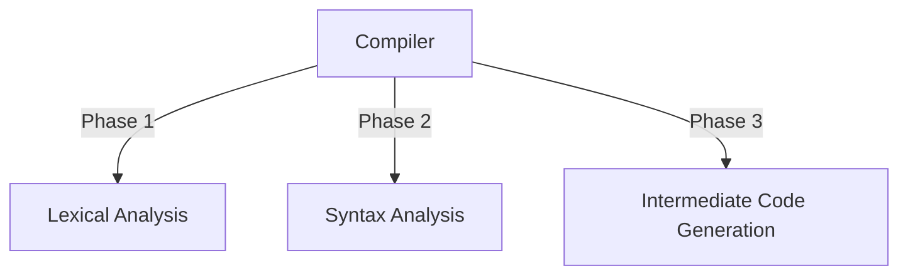

# Compiler
Design a tiny compiler with `Lex` and `Yacc`.

## About
The project is supposed to read a calculation expression and produce a three-address code in C Language.
The project has been divided into three phases.


## Running
```
  flex  lex.l
  gcc   lex.yy.c
        a.exe
```        
