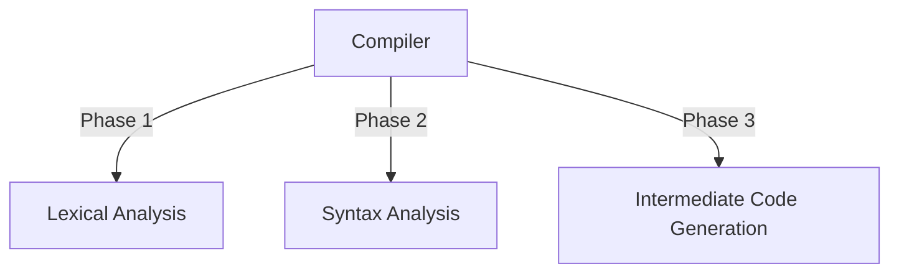

# Compiler
Design a tiny compiler with **Lex** and **Yacc**.


## About
The project is supposed to read a calculation expression and produce a three-address code in C Language.

The project has been divided into three phases.


## Running
### Phase 1
```
  flex  lex.l
  gcc   lex.yy.c
        a.exe
```        
### Phase 2
```
  bison -d -y   yacc.y
  gcc           y.tab.c
                a.exe
``` 
### Phase 3 (Project)
```
  bison -d -y       yacc.y
  flex              lex.l
  gcc   lex.yy.c    y.tab.c
                    a.exe
``` 
